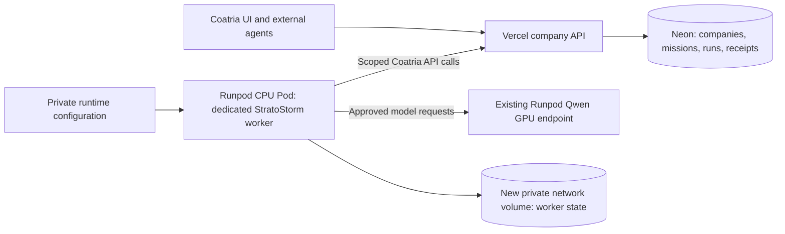

# Coatria managed harness hosting

Decision updated 2026-09-17: the user selected **Runpod CPU Pods** for the first hosted worker. This document specifies that dedicated company pilot and the separate work needed for a production fleet. Provisioning and the first real company task remain pending at this revision; the architecture is not a deployment receipt.

## Selected first deployment

Keep the existing Vercel application and Neon database. Run the trusted Coatria HTTP worker on a **dedicated Runpod CPU Pod with 2 vCPU and 4 GB RAM (`cpu: {id: "cpu3c", vcpuCount: 2}`)**, using a **new private network volume** for worker state. The existing **Qwen3.8-27B-FP8 Serverless GPU endpoint** remains a separate inference service. This choice requires no AWS account. The initial test has a fixed expiry; continuous service requires an explicitly maintained hosting allowance.

The CPU worker handles Coatria's queue, lease renewal, typed tool calls and scheduled mission checks. Runpod GPU workers generate model responses. The CPU Pod stays available for scheduling while GPU inference can scale to zero between requests. Closing the customer's browser or switching off the customer's computer must not affect either cloud component once this deployment is verified.

This is one company, one trusted worker and one leased run at a time for its agent. The first harness uses the reviewed HTTP provider adapter and typed Coatria tools. It does not expose shell execution, arbitrary plugins or browser automation to the model. Codex/Claude Code execution, customer-supplied harness code and multi-tenant sandboxes require separate execution profiles and security tests.

The existing external-worker installation/API supplies the pilot identity. Hosting that worker on Runpod does not mean a new managed-installation mode, workload-identity broker or fleet control plane has already shipped.

## Pod, storage and deployment contract

| Component | Initial configuration and boundary |
| --- | --- |
| CPU compute | One dedicated 2-vCPU/4-GB CPU Pod; confirm the available CPU flavor, datacenter and price before creation |
| Worker | Reviewed Node.js runtime, `agent-worker.mjs` and `provider-adapter.mjs`; fixed Coatria origin, approved endpoint/model and bounded limits |
| Durable disk | A newly created account-private network volume, attached at Pod creation; record the actual volume ID, size, datacenter and mount |
| GPU inference | Existing Qwen endpoint; set an explicit maximum worker count and idle policy for the approved pilot |
| Credentials | Dedicated company agent credential and private inference credential supplied to the trusted runtime; never committed, logged or sent to the model |
| Networking | Outbound Coatria and Runpod access; no public worker UI or inference listener; any temporary setup access must be removed or explicitly retained under operator control |
| Evidence | Record Pod/volume IDs, source/image version, worker contact, task/run IDs, model usage and restart outcome after verification |

Runpod network volumes persist independently of compute and typically mount at `/workspace` for Pods. They must be attached during Pod deployment and require a supported Secure Cloud location. Validate CPU/volume compatibility and placement before launching; a network volume does not imply a private VPC or enforced outbound firewall. Do not share the company worker's volume with the GPU model cache or another company. [Network volumes](https://docs.runpod.io/storage/network-volumes), [Pod creation API](https://docs.runpod.io/api-reference-v2/pods/create-a-pod)

Store the worker state file under a private directory on that volume. The current file contains lease credentials and recovery bookkeeping, so it must not be downloadable from an application endpoint or included in reports. Keep runtime provider credentials outside ordinary state/artifact files. Container-root scratch space remains disposable.

A volume is persistence, not a backup or a distributed lock. Use only one writer for this worker state; verify shutdown before replacement, and inspect stale state/locks rather than deleting them automatically. Record a backup/restore procedure separately. Storage charges continue while compute is stopped. [Runpod storage options](https://docs.runpod.io/pods/storage/types)

Use reviewed, versioned code and a pinned image where supported. Run the worker under an unprivileged user with private file permissions; avoid unnecessary services, package installation during every mission, model-supplied commands and privileged container access. A successful Pod creation response is not proof that the worker has started or can complete a model/tool cycle.

## What persists and what still fails safely

The released bridge has typed tools, current-authority checks, leases, contribution review, mutation receipts, queued Runpod inference and bounded missions. The cloud pilot retains these contracts:

- The online CPU worker checks its own approved missions at startup and at most once per minute when idle. Scheduling is independent of the desktop, but still depends on this Pod being available.
- Coatria stores company tasks, mission cycles, results and committed tool receipts in Neon.
- The network volume retains the worker's claim ID, lease state and pending completion across container replacement when correctly reattached.
- Model history, accepted Runpod job IDs, accumulated usage and reasoning progress still primarily live in process memory.
- Interrupted or uncertain model execution is not restarted automatically. Mission lease expiry fails the cycle and later scheduling requires review.
- Existing stable request IDs and server receipts support reconciliation of committed Coatria writes; they do not provide a complete persisted inference checkpoint.

A persistent volume does not make an interrupted agent resume at an arbitrary reasoning step. Restart tests must distinguish an idle worker restart from a crash during inference or after a tool effect. Until durable provider checkpoints exist, ambiguous work remains paused for reconciliation.

There is no independent scheduler failover, autoscaled company fleet, company-wide dollar ledger or contractual availability guarantee in this pilot. CPU Pod availability, provider balance, GPU capacity and credentials can still block work.

## Credentials and isolation

For the first dedicated trusted worker, both the Coatria agent credential and inference credential are private runtime secrets. They are accessible to the operator-controlled worker process; this is not the future design in which untrusted execution never receives provider secrets. Use a dedicated inference credential with the narrowest supported scope, record its actual authority and keep account-provisioning access separate where possible.

Do not place a privileged secrets sidecar beside untrusted code and describe it as isolated. Before accepting customer-supplied code, add an independently secured tool/inference broker, short-lived run-scoped workload grants, an enforced egress policy and a tested execution boundary. Company/provider/endpoint/model/budget checks must then be enforced outside the untrusted executor.

The existing company credential was issued once and stored by Coatria as a hash. Setup material sealed on the operator's computer must be transferred only through private deployment configuration; the platform cannot recover the plaintext from its database. Rotation, permission changes and old-worker fencing must be explicit, with no duplicate live worker after migration.

Do not copy employee-owned private skills into company memory automatically. Personal skill sharing and exportable experience need their own authorization rules. Private editing footage should remain behind a scoped outbound storage connector/gateway; a cloud worker does not gain blanket NAS access or public SMB exposure.

## First company run and release gates

1. **Provision the dedicated worker:** confirm the selected CPU/volume quote and compatible datacenter, create the new volume, launch the Pod and install the reviewed runtime/configuration.
2. **Verify cloud ownership:** observe the correct company identity and recent worker contact from the Pod. No local worker may be responsible for that contact.
3. **Run one bounded company task:** first honor an already-approved company mission; otherwise use the launch-checklist objective, limited tools and a small cycle count. Verify the actual task, contribution, result and receipts; leave work for independent human review.
4. **Verify autonomous scheduling:** allow a genuinely due scheduled cycle to execute from the cloud. Do not count an accelerated test clock or manual API tick as evidence of the normal scheduler.
5. **Verify persistence and restart:** restart an idle worker using its volume, confirm state belongs to the same origin/credential and prove only one worker owns it. Separately test interrupted execution and expect safe review when recovery is uncertain.
6. **Verify controls:** pause the agent/mission, revoke authority, rotate the private runtime secret and confirm subsequent unauthorized effects are refused. Check GPU worker limits, idle shutdown and CPU/storage billing.
7. **Report actual state:** record whether the Pod is still running, the GPU's configured and observed state, ongoing charges and any unresolved gates. Only then call this dedicated cloud pilot operational.

The owner can shut down their computer after the worker has been established in Runpod; provisioning and a cloud-origin completed run are necessary evidence. A browser heartbeat or local test is insufficient.

## Costs and operating limits

The dedicated CPU Pod stays running so it can poll for work and schedule missions. Its billing is independent of GPU scale-to-zero. It is not an ephemeral per-request CPU service.

| Resource | Illustrative estimate | Qualification |
| --- | --- | --- |
| CPU3, 2 vCPU and 4 GB | Approximately $0.06/hour, or $43.80 at 730 hours | Catalog-derived; verify the deployed flavor and actual hourly quote |
| New standard network volume | Published first-tier rate $0.07/GB/month | Size and actual quote are recorded at provisioning; continues while CPU compute is stopped |
| Existing Qwen L40S Serverless GPU | Previously verified approximately $1.75 per active GPU-hour | Billed startup/idle periods, storage and account charges must also be accounted for |

These are component estimates, not a complete platform quote or customer price. CPU catalog fields reviewed on 2026-09-17 did not explicitly state a time unit; the estimate follows Runpod's hourly Pod convention. [CPU catalog](https://docs.runpod.io/api-reference-v2/catalog/list-cpu-types), [Pod billing](https://docs.runpod.io/pods/pricing), [Network storage pricing](https://docs.runpod.io/storage/network-volumes)

The existing pilot measured a cold Qwen request at about 291 seconds and warm requests at 11–18 seconds. Display “Starting model” during cold startup. A persistent CPU worker does not eliminate GPU startup delay. Warm GPU capacity is a separately authorized recurring cost.

Use the installed token/step/deadline limits, a small mission cycle budget and a conservative GPU worker maximum. These controls are not an exact company dollar cap. Before commercial multi-company operation, atomically reserve spending allowances, enforce additional inference admissions through a broker, reconcile provider invoices and bound remaining exposure from already-running requests.

## Production service direction after the pilot

An agent should become a persistent company identity whose compute can be released between jobs. The current dedicated always-on CPU Pod is a practical first deployment, not a requirement to buy a permanent machine for every employee.

The later product can offer Coatria Managed, dedicated company capacity and bring-your-own infrastructure. Keep harness/model/hosting choices distinct. Office presence must reflect real working, waiting, reviewing and idle states; character animation must not imply inference is running.

The production fleet requires the following additions. Names are proposed; this plan applies no migrations:

| Addition | Purpose |
| --- | --- |
| Installation `execution_mode` and `hosting_profile_id` | Explicit managed hosting; existing installations stay external until deliberately migrated |
| Central scheduler | Schedule approved company missions without depending on each online worker; preserve no-overlap, no-catch-up and live-authority checks |
| Dispatch outbox | Create run and dispatch intent atomically; queue messages contain identifiers/version numbers only |
| Execution records | Exact run/generation, executor ID, image version, region, lease, limits and startup/reconciliation deadline |
| Durable checkpoints and provider request records | Bounded encrypted history, request intent, accepted job ID, usage, tool intents and uncertainty state |
| Scoped identity and provider broker | Short-lived run authority, separately protected credentials, live policy and egress enforcement |
| Usage reservations and ledger | Atomic admission against company/agent/mission allowances and auditable reconciliation |
| Private artifact/backup services | Company-scoped access, retention, restore evidence and approved employee-skill boundaries |

An exact-run managed claim must supplement today's per-agent “next queued run” claim. Every managed tool/checkpoint/inference/artifact operation needs current authority, execution generation and cancellation checks. Keep the same public invocation/tool contracts for external agents and document new operations through OpenAPI.

For a future queued executor, a launch acknowledgement is not a completed handoff. Persist the generation, reviewed launch request, accepted executor ID and startup deadline before acknowledging dispatch; the durable reconciler owns startup and completion afterwards. If the chosen provider does not document a launch idempotency mechanism, do not assume retrying Pod creation is safe. Reconcile inventory and ownership before creating another instance.

| Interruption | Production requirement; not an existing full-resume guarantee |
| --- | --- |
| Duplicate dispatch | Resolve the same execution or terminal outcome; fence stale generations |
| Worker dies after a recorded provider acceptance | Resume polling that known job ID from a durable checkpoint |
| Submission may have succeeded without a received job ID | Mark `needs_reconciliation`; never automatically repeat inference |
| Tool committed but response was lost | Reconcile the original request ID and receipt |
| Authority revoked during inference | Best-effort provider cancellation and rejection of subsequent unauthorized effects |
| Approval required | Preserve the request and release execution capacity while waiting |
| Regional outage | Audited recovery that prevents two regions from owning the same run |

Do not promise rollback of prior effects or deduplication of an external service that exposes no idempotency/reconciliation mechanism. Multi-company release requires tenant-isolation tests, fairness and admission limits, crash/restore drills, provider-load tests, alert ownership and measured service objectives. The 50-session office regression is not evidence of fifty inference workers or worldwide capacity.

## Optional future executor backends

Define an executor interface (`start`, `inspect`, `cancel`, `collect`) and conformance tests. Runpod CPU Serverless may suit bounded jobs after checkpointing and dispatch are implemented; an infinite polling worker is unsuitable for a request handler intended to scale to zero.

Vercel Workflows is another option for durable HTTP orchestration. Split provider submit, poll, tool effects and checkpoints into appropriate boundaries; never wrap the entire present adapter in an automatically retried step. Individual steps retain Function limits, and authoritative business audit must outlive workflow retention. [Workflows](https://vercel.com/docs/workflows)

AWS ECS/Fargate with a durable queue and independently secured broker remains an optional later backend if isolation, networking, workload identity or economics justify it. It is not the selected deployment and does not block this Runpod pilot. No Kubernetes or additional cloud account is required for the chosen first step.

## Current state at this revision

Avery's StratoStorm identity has been installed with workspace/task/office-presence grants. Its credential was sealed locally with Windows user encryption during setup. No persistent desktop worker was launched and no real company checklist was executed at the point this revision was prepared. The previous Qwen pilot endpoint was returned to zero allowed workers with zero workers observed; the authorized cloud deployment will need an explicit inference-capacity setting.

The user has selected the dedicated Runpod CPU Pod and new network volume. The Pod, mounted state, cloud-origin company task and scheduled follow-up are still pending verification here. Append the actual provisioning/test evidence after those steps complete; do not infer deployment success from this specification.
