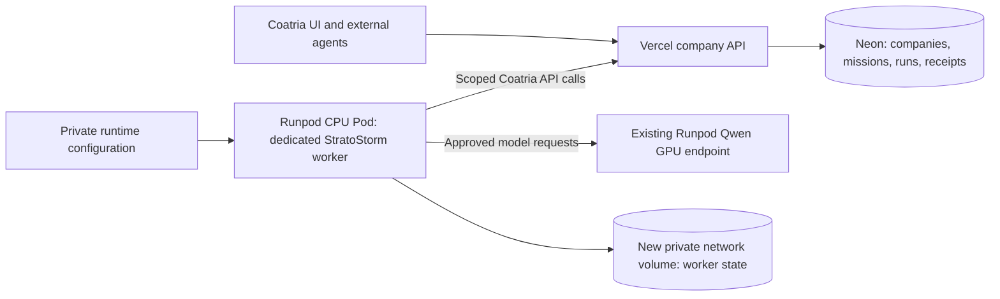

# Coatria managed harness hosting

Updated 2026-09-17: the first dedicated company worker is **provisioned on a Runpod CPU Pod** with a new network volume. The cloud worker passed a real model connection test and restored its saved state after restarting on the same Pod and volume. Two hosted mission failures remain distinct: floor geometry exhausted context before the adapter correction, then the recovery cycle spent its entire 2,048-token completion allowance on reasoning and returned no final answer. The installation and cloud worker now allow 8,192 output tokens per step; the manually dispatched third cycle succeeded at 16:53:13.544 UTC and submitted the existing task for independent review. This is a bounded hosted pilot, not a completed production-fleet rollout. The concrete deployment and cutoff contract are in [Runpod CPU hosting](RUNPOD_CPU_HOSTING.md).

The successful hosted workflow does not validate its research quality. The submitted brief was explicitly provisional and had no external research connector; review identified factual errors. Its contribution remains unaccepted and requires independent fact-checking.

## Selected first deployment

The existing Vercel application and Neon database serve the company. The trusted Coatria HTTP worker runs on a **dedicated Runpod CPU Pod with 2 vCPU and 4 GB RAM (`cpu: {id: "cpu3c", vcpuCount: 2}`), in `US-NC-2`**, using a **new 10 GB standard network volume** for worker state. The existing **Qwen3.8-27B-FP8 Serverless GPU endpoint** remains a separate inference service. This choice requires no AWS account. The pilot expires at **2026-09-17 18:11 UTC (11:11 a.m. Pacific)**; continuous service requires an explicitly maintained hosting allowance.

The CPU worker handles Coatria's queue, lease renewal, typed tool calls and scheduled mission checks. Runpod GPU workers generate model responses. The CPU Pod stays available for scheduling while GPU inference can scale to zero between requests. The hosted runtime and independent Vercel cutoff do not require the customer's browser or desktop process. GPU limits are configured at minimum 0, maximum 1 and a 60-second idle grace period. At 16:43:54 UTC, the provider reported zero running, initializing and idle GPU workers; three historical entries remained throttled. This proves an idle observation between jobs, not permanent GPU shutdown while new work is admitted.

This is one company, one trusted worker and one leased run at a time for its agent. The first harness uses the reviewed HTTP provider adapter and typed Coatria tools. It does not expose shell execution, arbitrary plugins or browser automation to the model. Codex/Claude Code execution, customer-supplied harness code and multi-tenant sandboxes require separate execution profiles and security tests.

The existing external-worker installation/API supplies the pilot identity. Hosting that worker on Runpod does not mean a new managed-installation mode, workload-identity broker or fleet control plane has already shipped.

## Pod, storage and deployment contract

| Component | Initial configuration and boundary |
| --- | --- |
| CPU compute | One dedicated `cpu3c` 2-vCPU/4-GB CPU Pod in `US-NC-2`; quoted $0.06/hour |
| Worker | Official Node 24.19.0 image pinned by digest; reviewed source verified before execution; UID/GID 1000, fixed Coatria origin and bounded model/tool limits |
| Durable disk | New account-private 10 GB standard network volume at `/state`; private worker state directory; same volume retained through verified restart |
| GPU inference | Existing Qwen endpoint; minimum 0, maximum 1 and idle timeout 60 seconds; zero active workers observed at 16:43:54 UTC between jobs |
| Credentials | Dedicated company agent credential and private inference credential supplied to the trusted runtime; never committed, logged or sent to the model |
| Networking | Outbound HTTPS; no exposed ports, SSH, Jupyter or global networking |
| Evidence | Private provisioning/worker receipts record identity and resources; public release evidence includes connection success, restart, source revision and remaining gates without private company objectives or task content |

Runpod network volumes persist independently of compute and typically mount at `/workspace` for Pods. They must be attached during Pod deployment and require a supported Secure Cloud location. Validate CPU/volume compatibility and placement before launching; a network volume does not imply a private VPC or enforced outbound firewall. Do not share the company worker's volume with the GPU model cache or another company. [Network volumes](https://docs.runpod.io/storage/network-volumes), [Pod creation API](https://docs.runpod.io/api-reference-v2/pods/create-a-pod)

Store the worker state file under a private directory on that volume. The current file contains lease credentials and recovery bookkeeping, so it must not be downloadable from an application endpoint or included in reports. Keep runtime provider credentials outside ordinary state/artifact files. Container-root scratch space remains disposable.

A volume is persistence, not a backup or a distributed lock. Use only one writer for this worker state; verify shutdown before replacement, and inspect stale state/locks rather than deleting them automatically. Record a backup/restore procedure separately. Storage charges continue while compute is stopped. [Runpod storage options](https://docs.runpod.io/pods/storage/types)

Use reviewed, versioned code and a pinned image where supported. Run the worker under an unprivileged user with private file permissions; avoid unnecessary services, package installation during every mission, model-supplied commands and privileged container access. A successful Pod creation response is not proof that the worker has started or can complete a model/tool cycle.

## What persists and what still fails safely

The released bridge has typed tools, current-authority checks, leases, contribution review, mutation receipts, queued Runpod inference and bounded missions. The cloud pilot retains these contracts:

- The online CPU worker checks its own approved missions at startup and at most once per minute when idle. Scheduling is independent of the desktop, but still depends on this Pod being available.
- Coatria stores company tasks, mission cycles, results and committed tool receipts in Neon.
- The network volume retains the worker's claim ID, lease state and pending completion across container replacement when correctly reattached.
- Model history, accepted Runpod job IDs, accumulated usage and reasoning progress still primarily live in process memory.
- Interrupted or uncertain model execution is not restarted automatically. Mission lease expiry fails the cycle and later scheduling requires review.
- Existing stable request IDs and server receipts support reconciliation of committed Coatria writes; they do not provide a complete persisted inference checkpoint.

A persistent volume does not make an interrupted agent resume at an arbitrary reasoning step. Restart tests must distinguish an idle worker restart from a crash during inference or after a tool effect. Until durable provider checkpoints exist, ambiguous work remains paused for reconciliation.

There is no independent scheduler failover, autoscaled company fleet, company-wide dollar ledger or contractual availability guarantee in this pilot. CPU Pod availability, provider balance, GPU capacity and credentials can still block work.

## Credentials and isolation

For the first dedicated trusted worker, both the Coatria agent credential and inference credential are private runtime secrets. They are accessible to the operator-controlled worker process; this is not the future design in which untrusted execution never receives provider secrets. Use a dedicated inference credential with the narrowest supported scope, record its actual authority and keep account-provisioning access separate where possible.

Do not place a privileged secrets sidecar beside untrusted code and describe it as isolated. Before accepting customer-supplied code, add an independently secured tool/inference broker, short-lived run-scoped workload grants, an enforced egress policy and a tested execution boundary. Company/provider/endpoint/model/budget checks must then be enforced outside the untrusted executor.

The existing company credential was issued once and stored by Coatria as a hash. Setup material sealed on the operator's computer must be transferred only through private deployment configuration; the platform cannot recover the plaintext from its database. Rotation, permission changes and old-worker fencing must be explicit, with no duplicate live worker after migration.

Do not copy employee-owned private skills into company memory automatically. Personal skill sharing and exportable experience need their own authorization rules. Private editing footage should remain behind a scoped outbound storage connector/gateway; a cloud worker does not gain blanket NAS access or public SMB exposure.

## First company run and release gates

| Gate | Evidence at this revision |
| --- | --- |
| Provisioning and cloud contact | Worker first live at 16:18 UTC on 2026-09-17; dedicated CPU and new volume provisioned; real model connection test passed |
| First company mission | Created and reserved a task, then failed its context budget because the workspace summary included full floor geometry; no completed business outcome is claimed |
| Context correction | Provider adapter now presents a compact workspace overview without floor geometry; the public API is unchanged and `layout_get` still exposes the full layout |
| Recovery cycle | After the context correction, Qwen consumed all 2,048 completion tokens in reasoning and ended with `finish_reason: length`, without a final answer; the run failed rather than being recorded as successful |
| Further retry | Installation and cloud environment now allow 8,192 output tokens per step; 80,000 total tokens, 600 seconds and 8 steps are unchanged. Third cycle manually dispatched at 16:44 UTC; result recorded at 16:53:13.544 UTC. One task and one contribution are in review; no duplicate or acceptance was observed. Lifetime limit remains 3, so no automatic fourth cycle is authorized |
| Restart and saved state | Same CPU and network volume restarted; worker logged `state-restored` at 16:30:48 UTC and again at 16:43:02.795 UTC after the allowance update; this does not prove mid-inference crash recovery |
| Independent cutoff | Production Vercel minute cron produced actual scheduled HTTP 200 responses; expiry is 18:11 UTC; before expiry it performs no provider mutations |
| Normal mission scheduling | Not verified in this pilot: retries were manually dispatched. The cutoff cron is separate and is not evidence of a normally due mission cycle |
| Capacity and billing | At 16:43:54 UTC, zero running/initializing/idle GPU workers were observed, with three throttled historical entries. Account rate fell to approximately $0.077/hour for CPU and storage; this is not zero spend or a final invoice |

Additional controls still need dedicated drills: authority revocation during work, runtime-secret rotation, interrupted inference, stale-lock recovery, regional outage and backup restoration. Existing automated authorization checks do not replace these operational exercises.

## Costs and operating limits

The dedicated CPU Pod stays running so it can poll for work and schedule missions. Its billing is independent of GPU scale-to-zero. It is not an ephemeral per-request CPU service.

| Resource | Pilot quote or estimate | Qualification |
| --- | --- | --- |
| CPU3, 2 vCPU and 4 GB | Quoted $0.06/hour, or $43.80 at 730 hours | Actual selected `cpu3c` Pod; a quote is not proof of current billing |
| New 10 GB standard network volume | Approximately $0.70/month at $0.07/GB/month | Continues while CPU compute is stopped |
| Existing Qwen L40S Serverless GPU | Previously verified approximately $1.75 per active GPU-hour | Billed startup/idle periods, storage and account charges must also be accounted for |

These are component quotes and estimates, not a complete platform quote or customer price. The live CPU API retained its $0.06 quote after reporting `EXITED`; the reaper therefore verifies lifecycle state and returns `billingVerified: false`. Actual billing requires separate provider reconciliation. [CPU catalog](https://docs.runpod.io/api-reference-v2/catalog/list-cpu-types), [Pod billing](https://docs.runpod.io/pods/pricing), [Network storage pricing](https://docs.runpod.io/storage/network-volumes)

The production Vercel reaper authenticates with a private cron secret, verifies exact operator-configured resource identities and independently disables the GPU endpoint and stops the CPU after expiry. Subsequent cron requests reconcile pending stops and transient failures. It never deletes the state volume. Provider or scheduler outages may delay the cutoff; it is not a guaranteed dollar cap. See [the independent cutoff contract](RUNPOD_CPU_HOSTING.md#independent-cutoff).

The existing pilot measured a cold Qwen request at about 291 seconds and warm requests at 11–18 seconds. Display “Starting model” during cold startup. A persistent CPU worker does not eliminate GPU startup delay. Warm GPU capacity is a separately authorized recurring cost.

Use the installed token/step/deadline limits, a small mission cycle budget and a conservative GPU worker maximum. These controls are not an exact company dollar cap. Before commercial multi-company operation, atomically reserve spending allowances, enforce additional inference admissions through a broker, reconcile provider invoices and bound remaining exposure from already-running requests.

## Production service direction after the pilot

An agent should become a persistent company identity whose compute can be released between jobs. The current dedicated always-on CPU Pod is a practical first deployment, not a requirement to buy a permanent machine for every employee.

The later product can offer Coatria Managed, dedicated company capacity and bring-your-own infrastructure. Keep harness/model/hosting choices distinct. Office presence must reflect real working, waiting, reviewing and idle states; character animation must not imply inference is running.

The production fleet requires the following additions. Names are proposed; this plan applies no migrations:

| Addition | Purpose |
| --- | --- |
| Installation `execution_mode` and `hosting_profile_id` | Explicit managed hosting; existing installations stay external until deliberately migrated |
| Central scheduler | Schedule approved company missions without depending on each online worker; preserve no-overlap, no-catch-up and live-authority checks |
| Dispatch outbox | Create run and dispatch intent atomically; queue messages contain identifiers/version numbers only |
| Execution records | Exact run/generation, executor ID, image version, region, lease, limits and startup/reconciliation deadline |
| Durable checkpoints and provider request records | Bounded encrypted history, request intent, accepted job ID, usage, tool intents and uncertainty state |
| Scoped identity and provider broker | Short-lived run authority, separately protected credentials, live policy and egress enforcement |
| Usage reservations and ledger | Atomic admission against company/agent/mission allowances and auditable reconciliation |
| Private artifact/backup services | Company-scoped access, retention, restore evidence and approved employee-skill boundaries |

An exact-run managed claim must supplement today's per-agent “next queued run” claim. Every managed tool/checkpoint/inference/artifact operation needs current authority, execution generation and cancellation checks. Keep the same public invocation/tool contracts for external agents and document new operations through OpenAPI.

For a future queued executor, a launch acknowledgement is not a completed handoff. Persist the generation, reviewed launch request, accepted executor ID and startup deadline before acknowledging dispatch; the durable reconciler owns startup and completion afterwards. If the chosen provider does not document a launch idempotency mechanism, do not assume retrying Pod creation is safe. Reconcile inventory and ownership before creating another instance.

| Interruption | Production requirement; not an existing full-resume guarantee |
| --- | --- |
| Duplicate dispatch | Resolve the same execution or terminal outcome; fence stale generations |
| Worker dies after a recorded provider acceptance | Resume polling that known job ID from a durable checkpoint |
| Submission may have succeeded without a received job ID | Mark `needs_reconciliation`; never automatically repeat inference |
| Tool committed but response was lost | Reconcile the original request ID and receipt |
| Authority revoked during inference | Best-effort provider cancellation and rejection of subsequent unauthorized effects |
| Approval required | Preserve the request and release execution capacity while waiting |
| Regional outage | Audited recovery that prevents two regions from owning the same run |

Do not promise rollback of prior effects or deduplication of an external service that exposes no idempotency/reconciliation mechanism. Multi-company release requires tenant-isolation tests, fairness and admission limits, crash/restore drills, provider-load tests, alert ownership and measured service objectives. The 50-session office regression is not evidence of fifty inference workers or worldwide capacity.

## Optional future executor backends

Define an executor interface (`start`, `inspect`, `cancel`, `collect`) and conformance tests. Runpod CPU Serverless may suit bounded jobs after checkpointing and dispatch are implemented; an infinite polling worker is unsuitable for a request handler intended to scale to zero.

Vercel Workflows is another option for durable HTTP orchestration. Split provider submit, poll, tool effects and checkpoints into appropriate boundaries; never wrap the entire present adapter in an automatically retried step. Individual steps retain Function limits, and authoritative business audit must outlive workflow retention. [Workflows](https://vercel.com/docs/workflows)

AWS ECS/Fargate with a durable queue and independently secured broker remains an optional later backend if isolation, networking, workload identity or economics justify it. It is not the selected deployment and does not block this Runpod pilot. No Kubernetes or additional cloud account is required for the chosen first step.

## Current state at this revision

The dedicated hosted worker is running within its fixed pilot window. Runtime release `77a77ebb55e376a9bee09c55db61dd4678342d8b` was verified deployed in Vercel deployment `dpl_3qNjZLiAMDU1ejMMMR5iUgSrotuW`, ready and aliased to `coatria.com`. The first release CI run [35245547823](https://github.com/stratostormstudios/coatria/actions/runs/35245547823) passed 305 tests with one skip; the latest run [35247034385](https://github.com/stratostormstudios/coatria/actions/runs/35247034385) succeeded with 318 tests passed, one skipped and no failures.

A real connection test, two same-volume state restorations and an idle interval with zero active GPU workers are verified. The third manually dispatched cycle succeeded and the mission completed at its lifetime limit; the contribution remains unaccepted for independent review. Normal mission scheduling is unverified and the lifetime limit of three authorizes no automatic fourth cycle. No private company objective, task identifier or result content is included here. PID-based state locking still needs operator reconciliation after an unclean restart; provider reasoning history and accepted-job recovery are not fully durable; fleet failover, backup/restore and company billing enforcement remain unimplemented production requirements. The fixed-expiry cloud pilot does not establish continuous hosting or general business autonomy.
