# Running an AI production studio in Coatria

This guide describes tested candidate `d5978ee`, updated 2026-09-20. Its four CI jobs passed with 1,063 application tests passed/4 explicit skips, 62 production-build browser cases and 17 deterministic agent-harness checks. Consult [release status](RELEASE_STATUS.md) for current public observations; deployment source, migrations, enabled services and running compute need their own read-back. Qualify the intended storage gateway/volume and archive host before enabling them.

The current path is **brief → references → Higgsfield generation → verified project file → independent review → exact package → authenticated client response**. New projects can use image, video or audio specifications. Existing frame-based Blender projects retain their legacy path; native workstation and general render-server expansion remain deferred.

There are two distinct storage integrations. The local/native drive connector indexes folder metadata only, including a folder already mounted by its operator. **Project files** uses an existing Runpod volume through the separately qualified gateway for actual upload, stored-byte verification and download. Neither integration automatically shares originals with Higgsfield. Approve references before supplying provider-supported arguments; a provider URL alone is not a verified archive or client delivery.

## Set up the company

Open **Production studio → Build an AI team**. Choose the **AI creative production studio** structure, describe the business and team size, then inspect the proposed roles, shared skills, model and permissions. Its producer, coordinator, creative director, reference specialist, generation specialist and delivery responsibilities may share agents. The separate QC responsibility belongs to an eligible human administrator. Apply the exact reviewed proposal to create paused specialists; existing company structures and saved work are preserved.

Select **Include a separate AI planning reviewer** to create a dedicated review identity without installing a plugin manually. It uses one slot within the total team size: a team of three becomes two production specialists plus one reviewer. Review its name, working style, exact `studio.read` and `studio.review` grants, versioned role instructions and model limits before applying. The instructions are saved in its installation; they do not create or access a private skill-vault entry. It starts paused with no producing or human QC role. Return to **Agent hosts** to enroll it separately. Staffing creates no review policy, host or compute, and does not change previously saved plans that omit this option.

Review role-specific creative and storage grants in the proposal. New coordinator/reference/delivery roles can receive storage read/organize; generation roles can receive creative read/write. Existing agents must already have any needed grants and are never silently upgraded by staffing. These permissions do not install Higgsfield, authorize paid generation, permit uploads or share files with clients. The company's reasoning model remains separate from its generation service.

Use **Manage studio team** for human or existing-agent assignments. Human assignment provides responsibility for linked tasks and updates unstarted work. Work already in progress or awaiting review must be completed or reset before reassignment; completed attribution stays intact. QC offers human owners/administrators only, and a saved ineligible reviewer must be replaced or left unassigned. Actual review still enforces per-output independence.

StratoStorm's earlier procedural pilot used three specialists; their saved identities have not been renamed or reconfigured by this UI change:

| Specialist | Responsibilities |
| --- | --- |
| Executive producer & team | Client discovery, scope, scheduling, coordination, delivery planning |
| VFX supervisor & team | Creative supervision, media provenance, CG and animation |
| Lighting & render specialist & team | Lighting, rendering, compositing and finishing |

Final media quality review stays with a suitable human administrator. A generated version's producer, agent sponsor, provider sponsor and registrar cannot approve it. For routine planning, explicitly authorize a different reviewer agent in **Coordination → Set planning review policy**. Give it only `studio.read` and `studio.review`. Estimate and breakdown are the default allowed stages; reference planning requires explicit selection. Shared-sponsor consent can permit distinct producer and reviewer agents sponsored by one administrator; acceptance remains labeled **machine planning review** and does not approve media or business gates.

## Connect the workers

**Agent hosts** registers a bounded company host and enrolls selected specialists. The default pilot lifetime is 20 minutes. Review each installation's model, permissions, and execution limits before enrollment.

**Agent hosts → Managed CPU hosting** prepares a reviewed server plan from selected exact installation versions. An operator first installs the pinned release, a company-specific retained volume, a server-only lifecycle key and a finite CPU reservation allowance. An explicit Coatria broker preset keeps all Runpod credentials on the server and adds a separately reviewed inference allowance and model-step limit. Direct-worker presets continue to require a separate endpoint-restricted inference key. Choose a 15, 20, 30 or 60 minute session, inspect agent permissions and limits, and start the reviewed plan. The server enrolls those agents, checks the current CPU price and inference access, and submits one fixed 2-vCPU / 4-GB Runpod Pod. An uncertain create is discovered rather than submitted twice. For a broker preset, the CPU requests each numbered inference step from Coatria; the server builds its prompt, policy and tool history from saved records and verified tool results. The CPU supervisor calls the separate inference service; it does not run a large Qwen model or Blender itself. A separate server reconciliation job requests and verifies shutdown at expiry. Leaving a browser tab open is not required.

**Stop compute** is independent of credential revocation and preserves retained state. Each host receives its own private journal directory on the company volume. Broker inference requests reserve their permitted timeout plus a one-minute margin at the reviewed rate, consume a finite session call allowance, and retain their monetary reservation after failures. No caller supplies a model, prompt history, provider job identifier or destination. Server cleanup can cancel known provider jobs after a host or run loses authority. Failed and cancelled starts remain counted in the CPU reservation allowance until an operator reviews actual charges; this is not a provider billing cap. Inference and storage are separate costs. A provider reporting RUNNING proves Pod state, not successful model output; verify actual agent requests and tool receipts.

Keep the one-time host credential in the server's private configuration. After the supervisor first connects, refresh the installation state before approving project delegation. Enrollment and supervisor takeover rotate credentials and invalidate a previously reviewed delegation snapshot.

## Bring in the brief

Choose **New project → AI media production**. Enter the project/client brief and AI-use policy, choose one output kind, and define named deliverables. Review the complete draft before creating it. A creation retry retains the exact reviewed request; if opening the created project fails, reopen that project rather than creating another.

Images specify PNG/JPEG/WebP, dimensions and an explicit color policy. Video specifies MP4/MOV, codec, dimensions, rational constant frame rate, duration interval and embedded-audio policy. Audio specifies WAV/MP3, codec, sample rate, channels and duration interval. Images and audio have no invented frame ranges or handles. Confirm that the chosen provider model can meet these requirements; unknown color tags are never assumed to be correct.

Existing VFX projects and the explicit legacy creation path retain frame ranges, handles and their original contracts. The controlled Blender preset remains a small original turntable, not a freeform client-footage renderer. Creating either kind of project creates work and dependencies; it does not submit generation, archive files, start compute or approve AI use.

Coatria prepares existing tasks in dependency order:

```mermaid
flowchart LR
  Brief[Client brief] --> Scope[Scope and estimate]
  Scope --> Plan[Shot breakdown and schedule]
  Plan --> References[Reference preparation]
  References --> Work[Reviewed generation request]
  Work --> Archive[Verified archive and registered version]
  Archive --> Review[Independent media review and task acceptance]
  Review --> Package[Exact package and accepted handoff]
  Package --> Acceptance[External account download and response]
```

Human decisions approve the brief, scope, and production. Unknown or restricted AI-use permission is a real constraint. Creating a project or writing a confident agent reply does not approve these gates.

The earlier **Studio pilot · Original product turntable** was an internal StratoStorm trial with no client footage or external delivery. Its recorded planning approval is historical; it does not establish current live company state or completed client production.

## Generate, archive and register

In **Generations & references**, select the exact generation task and a supported official tool from the connected Higgsfield catalog. Review the saved arguments, current task/project/connection revisions and credit consent before sending. Provider estimates are advisory. An uncertain submission stops for reconciliation; do not submit another request to guess whether the first one succeeded.

Tracked jobs distinguish queued/running/provider-completed results from verified bytes. Older or unrecognized receipts may not support tracking. A compatible adopted output can be saved to **Project files**: choose its exact linked folder and filename/version, review the source/destination and transfer bounds, then approve that archive. Archiving has separate authority from the original generation and requires the qualified worker/gateway. Wait for both source inspection and stored-byte verification.

Use **Register verified output** for the exact generation task. The picker checks the archive's request/task association; the server loads immutable source facts and compares them to the approved specification. Registration preserves the original producer and records the registrar separately. Inspect the exact version download and provenance; a file checksum, specification digest and artifact-manifest digest identify different evidence. Registration does not approve or submit the work.

## Let the coordinator delegate

In the project's **Coordination** tab, review the coordinator, allowed specialist roles, total specialist run allowance, concurrency, expiry, and policy state. Only an administrator can save this policy. It cannot add agent permissions or change a model's existing limits.

Use **Schedule coordinator** to prepare a recurring mission. The mission starts paused; review and activate it in **Company autopilot** when the worker is connected. The coordinator is instructed to inspect the actual project each cycle, then request an eligible exact planning review, handle its own ready planning task, or hand one ready task to an allowed specialist. The review policy has a separate finite reviewer-run allowance, expires within 24 hours, and pins the distinct reviewer and coordinator configurations.

Activation schedules the next eligible cycle after the configured interval. For the first test, use **Run next cycle now** after activation to queue a cycle immediately; it counts toward the existing cycle limit.

The run allowance counts coordinator-created specialist requests across the project's lifetime, including failed or cancelled requests. Editing the policy does not reset usage. Coordinator cycles and manually queued requests have separate limits; the allowance is not a dollar spending cap. Failed or uncertain handoffs need operator review before another attempt.

For version 2 projects, **Allow verified generated output continuations** is off by default. Review a new policy revision to enable it. A current coordinator may then resume the original assigned specialist from one exact verified archive, using the existing lifetime/concurrency allowance. The child can claim the existing task, register or reuse its pinned artifact and submit for independent review. It cannot generate again, transfer files, approve work or delegate. Archive completion alone starts no inference; an authorized active coordinator cycle must request the continuation. Failed children and competing registration require reconciliation. This is distinct from a new production pass after client feedback.

The coordinator is instructed to stop and report missing inputs or blocked work. The server enforces task dependencies, permissions, and approval gates; these controls do not guarantee an accurate model narrative. Confirm claimed progress against actual tool receipts, persisted task and run states, and independent review rather than accepting the agent's report alone.

## Advanced / legacy: render execution

This section documents the retained controlled-render path, which is deferred for new Higgsfield production. In **Generations & references**, expand **Advanced / legacy — Blender execution** to inspect existing connections and jobs. These controls are separate from Higgsfield. For an operator-approved legacy DCC step, the assigned specialist requires `studio.execute`; a human reviews the exact profile, frame range, specification and input references before execution. This capability does not permit unrestricted shell execution.

The current Blender profile builds original geometry and produces a native scene, EXR frames, a PNG preview, and a hashed manifest. It does not accept arbitrary `.blend` files, scripts, textures, or filmed footage. Its pilot limits are 24 frames, 1,024 pixels per axis, and 8 million aggregate pixels.

The operator can enable automatic private-media publication on the renderer worker. Completed output then uploads to private storage and is verified by reading and hashing the stored bytes. Interrupted publication keeps a durable retry record and holds new render claims. It never marks an upload as creative approval.

Promote the fully verified sequence to a pending Studio version. For a coordinator-delegated render, the next eligible coordinator cycle can dispatch one bounded follow-up to its original specialist. That run reads the pinned job and artifact evidence, claims the existing task and submits it for review; it cannot start another render, register another artifact, or inspect pixels through metadata tools. The same project lifetime run allowance and current approval gates apply. An independent human reviewer examines the exact version and records technical and creative review; the work board records task acceptance. Changes produce another version rather than overwriting the approved evidence.

## Prepare delivery

In **Review & delivery**, an eligible independent human reviews the exact registered media, records findings and attests technical QC. The producing/sponsoring/registrar identities cannot approve their own version. Then accept the separate generation and QC tasks under the existing self-review rules. Prepare the internal package from the latest independently approved final for each deliverable; it pins versions, hashes, specification and review receipts. Accept the delivery-handoff task before creating a client invitation.

The prepared manifest retains **not transferred** as its historical preparation state. The client-delivery panel supports verified generated image/video/audio versions and retained v1 private sequences through their separate transport contracts. The client signs in at `/delivery` without joining your company and gives you its account ID through an existing trusted channel. Confirm the exact identity, review package/expiry, then create the invitation. Coatria does not send it automatically; share the link through an authorized client channel.

Generated clients download exact immutable storage versions in bounded 4 MiB ranges. The browser reuses a live grant, renews before its expiry/age threshold and checks the complete length/SHA-256 before committing a save. Each gateway GET checks current authority, including reused grants. A cancelled, denied or corrupted transfer aborts without automatic retry; the fallback without a file-save picker is capped at 128 MiB and downloads are not resumable.

Portal opens, access issuance, local checksum success and explicit client response are separate events. Only the designated external account can acknowledge the exact package or request changes; the generated project displays that provenance read-only. No administrator manual-acceptance shortcut exists. A change request preserves evidence and returns the project to review, but does not plan revisions, create new work or authorize more generation automatically. No billing or invoice is sent.

## External harness access

The REST contract is published at [Coatria agent OpenAPI](https://coatria.com/api/agent/openapi). A connected harness discovers allowed tools through `/api/agent/tools`. Its tools use the same project state, role assignments, permissions, leases, and approval gates as the interface.

Company structure and task evidence are shared records; employee skill vaults remain separate. Harnesses explicitly opt into `contractVersion=2` to read or create generated projects and use the same registration/continuation services as the UI. Current scopes, live leases, exact role/task authority and independent review apply; public tool discovery grants no new permission. Grant-bearing file transport stays in the trusted worker, outside model context. Client invitations, revocation and responses remain human/account-specific operations.

The implemented forward generated-delivery flow still needs its actual deployed host, storage and recipient pilot. Native NAS/workstation access, general VFX, autonomous client rework, hiring/commerce, multi-tenant fleet recovery and million-user capacity remain outside this candidate. A reasoning host is not a renderer or storage server, and cycle/token limits are not a company-wide dollar cap.

Operational detail: [machine planning review](STUDIO_MACHINE_REVIEW.md), [managed CPU hosting](STUDIO_CPU_PROVISIONING.md), [server inference](STUDIO_INFERENCE.md), and [client delivery](STUDIO_CLIENT_DELIVERY.md).
