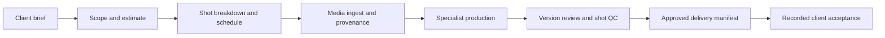

# Running an AI production studio in Coatria

The current production scope uses Higgsfield for references and generations: **brief → references → generation → review → delivery**. The Studio workspace keeps responsibilities, planning tasks and approvals separate from actual generation jobs and media evidence. Workstation and render-server execution are deferred. Existing Blender projects and execution records remain available under **Generations & references → Advanced / legacy**; they are not Higgsfield jobs.

Heavy footage, EXRs and renders remain on local, NAS or cloud storage. The current connected-drive service indexes a folder's file metadata only, including a cloud folder already mounted by your operator. It does not provide a cloud-object adapter, upload or download media, or grant a generation provider access to originals. Approve each reference or proxy before sending it externally. A provider result URL alone does not prove that the media was archived on your storage or delivered to a client.

## Set up the company

Open **Production studio → Build an AI team**. Describe your production business, choose the disciplines and team size, then inspect the proposed roles, shared skills, model, and permissions. Related responsibilities can share one agent. Apply the proposal to create real paused specialists.

Select **Include a separate AI planning reviewer** to create a dedicated review identity without installing a plugin manually. It uses one slot within the total team size: a team of three becomes two production specialists plus one reviewer. Review its name, working style, exact `studio.read` and `studio.review` grants, versioned role instructions and model limits before applying. The instructions are saved in its installation; they do not create or access a private skill-vault entry. It starts paused with no producing or human QC role. Return to **Agent hosts** to enroll it separately. Staffing creates no review policy, host or compute, and does not change previously saved plans that omit this option.

The new staffing draft describes the Higgsfield scope and initially selects only compositing as an existing planning/handoff responsibility. Existing role titles, shared instructions, permissions and saved proposals are preserved. Choosing these responsibilities does not install a Higgsfield connection or certify an automated DCC skill. The reasoning model selected for company agents is separate from the generation service.

StratoStorm's earlier procedural pilot used three specialists; their saved identities have not been renamed or reconfigured by this UI change:

| Specialist | Responsibilities |
| --- | --- |
| Executive producer & team | Client discovery, scope, scheduling, coordination, delivery planning |
| VFX supervisor & team | Creative supervision, media provenance, CG and animation |
| Lighting & render specialist & team | Lighting, rendering, compositing and finishing |

Final media quality review stays with a suitable human administrator. A person who produced or sponsored a version cannot independently approve it. For routine planning, a company can explicitly authorize a different reviewer agent in **Coordination → Set planning review policy**. Give that dedicated agent only the required `studio.read` and `studio.review` grants. The optional shared-sponsor setting permits a sole administrator to sponsor distinct producer and planning-reviewer agents; acceptance is always labeled **machine planning review**. This accepts the planning contribution, not the commercial estimate or production gate. Without that policy, the existing independent human acceptance rules apply.

## Connect the workers

**Agent hosts** registers a bounded company host and enrolls selected specialists. The default pilot lifetime is 20 minutes. Review each installation's model, permissions, and execution limits before enrollment.

**Agent hosts → Managed CPU hosting** prepares a reviewed server plan from selected exact installation versions. An operator first installs the pinned release, a company-specific retained volume, a server-only lifecycle key and a finite CPU reservation allowance. An explicit Coatria broker preset keeps all Runpod credentials on the server and adds a separately reviewed inference allowance and model-step limit. Direct-worker presets continue to require a separate endpoint-restricted inference key. Choose a 15, 20, 30 or 60 minute session, inspect agent permissions and limits, and start the reviewed plan. The server enrolls those agents, checks the current CPU price and inference access, and submits one fixed 2-vCPU / 4-GB Runpod Pod. An uncertain create is discovered rather than submitted twice. For a broker preset, the CPU requests each numbered inference step from Coatria; the server builds its prompt, policy and tool history from saved records and verified tool results. The CPU supervisor calls the separate inference service; it does not run a large Qwen model or Blender itself. A separate server reconciliation job requests and verifies shutdown at expiry. Leaving a browser tab open is not required.

**Stop compute** is independent of credential revocation and preserves retained state. Each host receives its own private journal directory on the company volume. Broker inference requests reserve their permitted timeout plus a one-minute margin at the reviewed rate, consume a finite session call allowance, and retain their monetary reservation after failures. No caller supplies a model, prompt history, provider job identifier or destination. Server cleanup can cancel known provider jobs after a host or run loses authority. Failed and cancelled starts remain counted in the CPU reservation allowance until an operator reviews actual charges; this is not a provider billing cap. Inference and storage are separate costs. A provider reporting RUNNING proves Pod state, not successful model output; verify actual agent requests and tool receipts.

Keep the one-time host credential in the server's private configuration. After the supervisor first connects, refresh the installation state before approving project delegation. Enrollment and supervisor takeover rotate credentials and invalidate a previously reviewed delegation snapshot.

## Bring in the brief

Choose **New project** and enter the client or internal project name, brief, AI-use policy, shots, exact frame ranges, handles, dimensions, rational frame rate, output format, and color space.

The **Production path** selector defaults to **Higgsfield · generations & references**, with a five-second, 1,920 × 1,080, 24 fps MP4 / Rec.709 planning specification and no handles. These are desired delivery settings, not a claim that every Higgsfield model supports that exact output. Confirm the chosen generation model's supported settings in **Generations & references**. Creating a project creates planning tasks; it does not submit a provider job, archive media, or approve the client's AI-use policy. Existing task stages remain visible and must not be interpreted as automatically connected generation steps.

**Manual production planning** keeps the draft's current custom specification. Selecting either the Higgsfield preset or **Advanced / legacy · Blender turntable preset** replaces draft shot/specification settings, never the brief or AI-use permission. The legacy preset is retained for existing controlled-render workflows: one lighting shot, frames 1001–1004, no handles, 384 × 384, 24 fps, Linear Rec.709 EXR and fixed original procedural geometry. Its existing capability checks remain in place. It does not turn a freeform brief into client footage or start compute, and render-server setup is outside the current production scope.

Coatria prepares existing tasks in dependency order:

Human decisions approve the brief, scope, and production. Unknown or restricted AI-use permission is a real constraint. Creating a project or writing a confident agent reply does not approve these gates.

The saved **Studio pilot · Original product turntable** is an internal StratoStorm trial: frames 1001–1004, 384 × 384, 24 fps, Linear Rec.709 EXR, with no client footage or external delivery. Its brief is approved for planning. It is not a completed client production.

## Let the coordinator delegate

In the project's **Coordination** tab, review the coordinator, allowed specialist roles, total specialist run allowance, concurrency, expiry, and policy state. Only an administrator can save this policy. It cannot add agent permissions or change a model's existing limits.

Use **Schedule coordinator** to prepare a recurring mission. The mission starts paused; review and activate it in **Company autopilot** when the worker is connected. The coordinator is instructed to inspect the actual project each cycle, then request an eligible exact planning review, handle its own ready planning task, or hand one ready task to an allowed specialist. The review policy has a separate finite reviewer-run allowance, expires within 24 hours, and pins the distinct reviewer and coordinator configurations.

Activation schedules the next eligible cycle after the configured interval. For the first test, use **Run next cycle now** after activation to queue a cycle immediately; it counts toward the existing cycle limit.

The run allowance counts coordinator-created specialist requests across the project's lifetime, including failed or cancelled requests. Editing the policy does not reset usage. Coordinator cycles and manually queued requests have separate limits; the allowance is not a dollar spending cap. Failed or uncertain handoffs need operator review before another attempt.

The coordinator is instructed to stop and report missing inputs or blocked work. The server enforces task dependencies, permissions, and approval gates; these controls do not guarantee an accurate model narrative. Confirm claimed progress against actual tool receipts, persisted task and run states, and independent review rather than accepting the agent's report alone.

## Advanced / legacy: render execution

This section documents the retained controlled-render path, which is deferred for new Higgsfield production. In **Generations & references**, expand **Advanced / legacy — Blender execution** to inspect existing connections and jobs. These controls are separate from Higgsfield. For an operator-approved legacy DCC step, the assigned specialist requires `studio.execute`; a human reviews the exact profile, frame range, specification and input references before execution. This capability does not permit unrestricted shell execution.

The current Blender profile builds original geometry and produces a native scene, EXR frames, a PNG preview, and a hashed manifest. It does not accept arbitrary `.blend` files, scripts, textures, or filmed footage. Its pilot limits are 24 frames, 1,024 pixels per axis, and 8 million aggregate pixels.

The operator can enable automatic private-media publication on the renderer worker. Completed output then uploads to private storage and is verified by reading and hashing the stored bytes. Interrupted publication keeps a durable retry record and holds new render claims. It never marks an upload as creative approval.

Promote the fully verified sequence to a pending Studio version. For a coordinator-delegated render, the next eligible coordinator cycle can dispatch one bounded follow-up to its original specialist. That run reads the pinned job and artifact evidence, claims the existing task and submits it for review; it cannot start another render, register another artifact, or inspect pixels through metadata tools. The same project lifetime run allowance and current approval gates apply. An independent human reviewer examines the exact version and records technical and creative review; the work board records task acceptance. Changes produce another version rather than overwriting the approved evidence.

## Prepare delivery

After all required production work and independent reviews are accepted, open **Review & delivery** and prepare a manifest containing the latest approved final version of every shot. This preserves versions, checksums, specification, and review receipts.

The prepared manifest alone is **not transferred**. For server-verified private image sequences, use the client-delivery panel to bind the exact package to a designated external Coatria account. The client can sign in at `/delivery` without joining your company and give you its account ID through your existing trusted communication channel. Confirm that identity out of band, review the package and access expiry, then create the invitation. Coatria does not send it automatically; share the link through an authorized client channel.

The portal issues temporary access only to the included verified files. It records portal opens, download access issuance, and the designated client’s acknowledgement or change request separately. Issuing a link does not prove bytes were received. Authenticated acknowledgement rechecks the current approved package, records exact client identity and package checksum, and closes that production. External artifact URLs alone cannot use this private-file portal. No billing or invoice is sent. Never impersonate a real client to complete a test.

## External harness access

The REST contract is published at [Coatria agent OpenAPI](https://coatria.com/api/agent/openapi). A connected harness discovers allowed tools through `/api/agent/tools`. Its tools use the same project state, role assignments, permissions, leases, and approval gates as the interface.

Company structure and task evidence are shared company records. Personal employee skill vaults remain separate. Current production is scoped to Higgsfield generations and references, with storage-only connected drives. The earlier controlled Blender pilot and private image-sequence portal remain documented as separate capabilities; they do not establish delivery of every generated movie or access to arbitrary connected-drive media. A company reasoning host is distinct from a workstation or render server. Neither this scope nor the earlier pilot certifies unrestricted fleet provisioning, a company-wide dollar ledger or million-user capacity. Rejected planning work needs a reviewed new producer pass; specialist coordination does not automatically retry uncertain or failed work.

Operational detail: [machine planning review](STUDIO_MACHINE_REVIEW.md), [managed CPU hosting](STUDIO_CPU_PROVISIONING.md), [server inference](STUDIO_INFERENCE.md), and [client delivery](STUDIO_CLIENT_DELIVERY.md).
