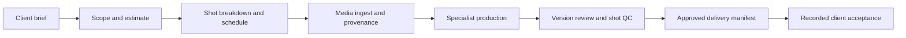

# Running an AI production studio in Coatria

The Studio workspace connects a client brief to specialist responsibilities, production tasks, real output evidence, review, and a delivery manifest. The current renderer is a controlled Blender product-turntable profile. Other VFX applications and client footage need additional approved connectors.

## Set up the company

Open **Production studio → Build an AI team**. Describe your production business, choose the disciplines and team size, then inspect the proposed roles, shared skills, model, and permissions. Related responsibilities can share one agent. Apply the proposal to create real paused specialists.

StratoStorm's initial team uses three specialists:

| Specialist | Responsibilities |
| --- | --- |
| Executive producer & team | Client discovery, scope, scheduling, coordination, delivery planning |
| VFX supervisor & team | Creative supervision, media provenance, CG and animation |
| Lighting & render specialist & team | Lighting, rendering, compositing and finishing |

Independent quality review stays with a suitable human administrator. A person who produced or sponsored a version cannot independently approve it. A studio with one administrator can set up its team and generate draft work, but the first agent-produced scope and estimate must remain in review until a different administrator who did not perform or sponsor that work accepts it. This blocks the dependent breakdown, ingest, and production tasks.

## Connect the workers

**Agent hosts** registers a bounded company host and enrolls selected specialists. The default pilot lifetime is 20 minutes. Review each installation's model, permissions, and execution limits before enrollment.

Registration is an access record. A Runpod CPU Pod running the Coatria supervisor must also be provisioned and configured by the operator. The CPU supervisor calls the separate model inference service; it does not run a large Qwen model or Blender itself. The current operator workflow uses an absolute expiry, a durable private state volume, and a server-side compute cutoff. Leaving a browser tab open is not required.

Keep the one-time host credential in the server's private configuration. After the supervisor first connects, refresh the installation state before approving project delegation. Enrollment and supervisor takeover rotate credentials and invalidate a previously reviewed delegation snapshot.

## Bring in the brief

Choose **New project** and enter the client or internal project name, brief, AI-use policy, shots, exact frame ranges, handles, dimensions, rational frame rate, output format, and color space.

Coatria prepares existing tasks in dependency order:

Human decisions approve the brief, scope, and production. Unknown or restricted AI-use permission is a real constraint. Creating a project or writing a confident agent reply does not approve these gates.

The saved **Studio pilot · Original product turntable** is an internal StratoStorm trial: frames 1001–1004, 384 × 384, 24 fps, Linear Rec.709 EXR, with no client footage or external delivery. Its brief is approved for planning. It is not a completed client production.

## Let the coordinator delegate

In the project's **Coordination** tab, review the coordinator, allowed specialist roles, total specialist run allowance, concurrency, expiry, and policy state. Only an administrator can save this policy. It cannot add agent permissions or change a model's existing limits.

Use **Schedule coordinator** to prepare a recurring mission. The mission starts paused; review and activate it in **Company autopilot** when the worker is connected. The coordinator is instructed to inspect the actual project each cycle, then handle its own ready planning task or hand one ready task to an allowed specialist.

Activation schedules the next eligible cycle after the configured interval. For the first test, use **Run next cycle now** after activation to queue a cycle immediately; it counts toward the existing cycle limit.

The run allowance counts coordinator-created specialist requests across the project's lifetime, including failed or cancelled requests. Editing the policy does not reset usage. Coordinator cycles and manually queued requests have separate limits; the allowance is not a dollar spending cap. Failed or uncertain handoffs need operator review before another attempt.

The coordinator is instructed to stop and report missing inputs or blocked work. The server enforces task dependencies, permissions, and approval gates; these controls do not guarantee an accurate model narrative. Confirm claimed progress against actual tool receipts, persisted task and run states, and independent review rather than accepting the agent's report alone.

## Render and inspect real outputs

For a supported DCC step, connect the controlled renderer and explicitly grant the assigned specialist `studio.execute`. This permits a render proposal, not unrestricted shell execution. In **Render jobs**, a human reviews the exact profile, frame range, specification, and input references before approving execution.

The current Blender profile builds original geometry and produces a native scene, EXR frames, a PNG preview, and a hashed manifest. It does not accept arbitrary `.blend` files, scripts, textures, or filmed footage. Its pilot limits are 24 frames, 1,024 pixels per axis, and 8 million aggregate pixels.

The operator can enable automatic private-media publication on the renderer worker. Completed output then uploads to private storage and is verified by reading and hashing the stored bytes. Interrupted publication keeps a durable retry record and holds new render claims. It never marks an upload as creative approval.

Promote the fully verified sequence to a pending Studio version. An independent reviewer examines the exact version and records technical and creative review; the work board records task acceptance. Changes produce another version rather than overwriting the approved evidence.

## Prepare delivery

After all required production work and independent reviews are accepted, open **Review & delivery** and prepare a manifest containing the latest approved final version of every shot. This preserves versions, checksums, specification, and review receipts.

The manifest is marked **not transferred**. The current platform does not automatically send media, invoice the client, or obtain a client acknowledgement. Use an authorized delivery process, then record actual acceptance and its evidence against that exact package. Never use the client-acceptance action merely to complete a test.

## External harness access

The REST contract is published at [Coatria agent OpenAPI](https://coatria.com/api/agent/openapi). A connected harness discovers allowed tools through `/api/agent/tools`. Its tools use the same project state, role assignments, permissions, leases, and approval gates as the interface.

Company structure and task evidence are shared company records. Personal employee skill vaults remain separate. The implemented pilot does not establish unrestricted VFX execution, automatic fleet provisioning, a company-wide dollar ledger, client transport, or million-user capacity.
