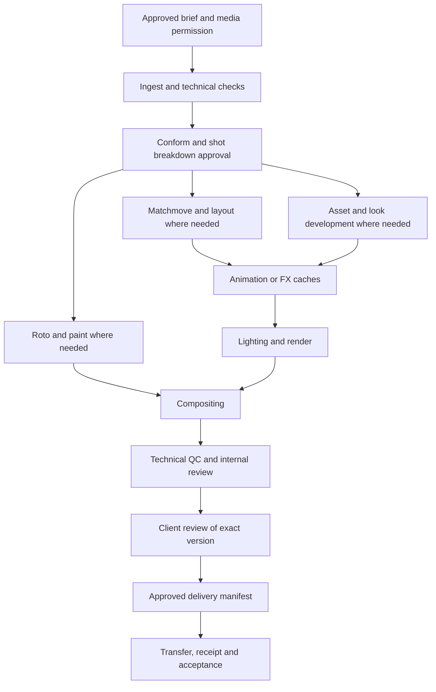

# Coatria AI/VFX studio blueprint

Research and implementation review: 2026-09-17. This document separates the implemented supervised studio workflow from the broader production design below. Repository tests and a build do not prove that a production database migration, hosted worker or external media connector is deployed. See [existing connections](CONNECTIONS.md) and [autonomous company boundaries](AUTONOMOUS_COMPANY.md).

## Implemented pilot and current boundaries

The current implementation is documented in [AI production Studio](AI_PRODUCTION_STUDIO.md), with detailed [managed hosting](STUDIO_HOSTING.md) and [controlled Blender execution](VFX_EXECUTION.md) contracts. That inventory supersedes earlier descriptive-only staffing notes in this blueprint. Applying migrations, deploying the website, connecting private storage, and starting a pinned worker remain distinct operations.

The `#studio` workflow now includes real reviewed staffing proposals that create paused specialist identities or bind existing installations, role-specific shared skills/personas, company-scoped encrypted host enrollment, project/shot/task dependencies, bounded agent dispatch, human-approved connector jobs, a procedural Blender turntable profile, private output byte verification, independent version review, and exact delivery manifests. A sole owner can prepare draft work with QC explicitly unassigned, then invite an independent administrator before accepting produced media.

The hosted supervisor currently runs curated Runpod HTTP agents. Host registration and staffing do not start compute or inference. New specialist grants omit `studio.execute`; a human separately approves that capability and each renderer job. The built-in renderer creates original procedural scenes and rejects arbitrary client files or commands. Separate private-media APIs verify uploaded stored bytes; the renderer can explicitly opt into durable automatic publication and server verification.

Reviewed bounded CPU sessions, machine planning review and authenticated private-file client delivery are implemented in the current repository; see the [operator guide](STUDIO_OPERATOR_GUIDE.md) for setup and evidence limits. Automatic fleet expansion, company-wide spending reservations, editable workflow branches, sequence/asset tracking, editorial conform/retime, arbitrary DCC scenes, Nuke/Houdini integration, heavy NAS transfers, and annotated client review remain outside this pilot. An internal delivery manifest and an administrator attestation are not evidence of file transfer or a client's receipt. This release does not establish million-user capacity.

The remaining sections describe the target production design and its acceptance criteria. They are not an inventory of implemented fields or installed capabilities.

The first useful studio should organize and execute a small, traceable production from approved intake to an acknowledged delivery. Its agents can coordinate work and invoke verified tools. They must distinguish a written plan, a rendered artifact, a supervisor-approved version and a client-accepted delivery.

## Production principles

Autodesk Flow separates shot/cut state, version review and delivery receipt. Adopt those distinctions instead of one universal “done” field. A shot can remain in production while one version is viewed, and a sent package is not yet an acknowledged delivery. [Flow status guidance](https://help.autodesk.com/cloudhelp/ENU/SG-Tutorials/files/SG_Tutorials_tu_tracking_statuses_html.html)

Publishing should produce an identifiable version with provenance and a validated file reference. Flow's publisher and loader distinguish published-file records from the files themselves and validate before publishing. Coatria should similarly avoid treating a task description or an arbitrary URL as a verified media publish. [Flow integrations and publishing](https://help.autodesk.com/view/SGDEV/ENU/?contextId=SA_INTEGRATIONS_USER_GUIDE)

Editorial changes are normal. Nuke Studio conforms source footage against edit decisions and reports missing media, including OTIO, EDL, AAF and XML workflows. Store the editorial revision and source-to-cut mapping rather than assuming that a shot's first frame range remains final. [Foundry conforming documentation](https://learn.foundry.com/nuke/content/timeline_environment/conforming/conforming.html)

The recommendations below are Coatria's proposed application of these practices. They are not vendor-certified workflows or a claim that all studios use identical departments and approval stages.

## Company setup and roles

The studio wizard proposes an organization, workflow template, role assignments, required integrations and cost limits. The owner reviews the proposal before it provisions identities or starts paid work. Roles are reusable responsibilities; several roles can share an employee in a small studio, except independent review must retain a separate authorized identity and the existing author/sponsor restrictions.

| Role template | Agent assistance and outputs | Reserved authority or prerequisite |
| --- | --- | --- |
| Executive producer / owner | Intake summary, capacity and cost forecasts | Commercial scope, budgets, paid services, staffing and final delivery authorization |
| Producer / coordinator | Shot breakdown, dependencies, schedules, blocker tracking, review agendas | May propose assignments; cannot grant itself capabilities or accept its own contribution |
| VFX supervisor | Proposed approach, technical/creative review checklist, escalation | Qualified human approves interpretation, shot quality and client submissions |
| Pipeline TD | Validates manifests, compatibility and reproducibility; prepares connector jobs | Reviewed scripts and execution profiles; no model-controlled arbitrary shell |
| Editorial / ingest | Conform checklist, source inventory, cut revisions, handles and turnover | Verified media access and editorial tooling; escalate missing or ambiguous footage |
| Matchmove / layout | Track/solve checks and staging proposals | Connected DCC or assigned artist produces camera/layout artifacts |
| Roto / paint | Matte/cleanup preparation, version and note tracking | Artist or validated image-processing connector; temporal quality review required |
| Asset / look development | Asset breakdown, dependency and material checks | Connected authoring tool; approved asset versions before downstream use |
| Animation / FX | Animation/simulation plans, cache checks, render estimates | Artist/DCC execution; solver, memory and license requirements verified |
| Lighting / compositing | Approved scene/template assembly, render submission, version preparation | Connected renderer/compositor; no inference-only claim of rendered output |
| Independent QC / reviewer | Technical checks, comparisons, issue summaries | Cannot approve an artifact it authored or sponsored; creative judgment stays explicit |
| Delivery coordinator | Package manifest, approvals check, receipt tracking | Owner-authorized destination and transfer integration; no unsolicited outbound message |

Each role includes a persistent role title, responsibilities, escalation rules, allowed tools and evidence requirements. A skill is a versioned procedure with declared inputs, outputs, integration requirements and owner. Company procedures and employee-owned private skills remain separate; installing a role does not copy a person's private experience into the company.

Start with a coordinator agent and human supervisor/reviewer. Add specialized executing agents when their toolchain is connected and a measured workload justifies them. A room full of characters is not evidence that a production has those capabilities.

## Intake and approval of the brief

The intake form must support `unknown` and a named person responsible for answering it. Do not invent missing delivery specifications. Save an immutable brief revision when the owner approves it.

- **Work:** client, project code, brief, references, intended audience, creative constraints, shot count estimate, deadline, feedback rounds, budget and named approvers.
- **Editorial:** cut revision, source clip identities, rational frame rate, source timecode, drop-frame flag where applicable, cut in/out, handle lengths, retimes, audio sync and omitted shots.
- **Image contract:** width/height, pixel aspect, source color space, approved working color configuration, display/view transform, output color space, alpha/AOV requirements, file/container/codec, bit depth and naming rules. Requirements vary by project; do not force ACES or EXR on every client.
- **Media:** source location/connector, file or sequence manifest, checksums, expected frames, transfer availability and storage/compute region restrictions.
- **Permission:** client authority to supply the material, permitted AI/generative processing, approved external providers, confidentiality, retention and whether source/project files are deliverables. A missing AI-use decision blocks that processing route.
- **Acceptance:** who can approve internally, who can give client approval, objective technical checks, delivery destination and what constitutes receipt/acceptance.

The coordinator drafts the breakdown and flags uncertainty. The owner approves scope, resources and execution permissions. A change to the approved brief creates a new revision and an impact proposal; it does not silently rewrite an in-progress delivery contract.

## Shot workflow and dependency graph

Use reusable templates with optional branches, not a mandatory chain containing every VFX discipline. Preserve separate project-level work such as bidding, asset creation and editorial management.

| Stage | Inputs and dependency | Output and handoff gate |
| --- | --- | --- |
| Ingest | Approved source location and intake revision | Manifest, integrity/media report and review proxies; missing media blocks turnover |
| Conform / breakdown | Source inventory and editorial revision | Stable shot codes, frame mapping, handles and stage plan; supervisor approves interpretation |
| Roto / paint | Specified plate version and cut range | Matte/clean-plate publish with temporal review; may proceed alongside CG preparation |
| Matchmove / layout | Plate, lens/camera information and approved scale assumptions | Camera/layout publish; downstream simulation/render uses the exact version |
| Asset / look development | Approved design and references | Model/material/rig publishes; native rig dependency retained when interchange is incomplete |
| Animation / FX | Approved camera/layout/assets; solver setup | Approved animation or simulation-cache versions; dependent frames respect solver order |
| Lighting / render | Pinned inputs, scene, color config and render profile | Frame manifest, render report and required passes; scheduler success alone is insufficient |
| Compositing | Explicit plate, matte and render versions | Comp script publish, full-quality output and review proxy |
| Internal QC / review | Submitted immutable artifact version | Automated technical report plus independent creative decision; changes request a new version |
| Client review | Internally approved version and scoped client access | Decision bound to that version; feedback becomes traceable notes/tasks |
| Delivery | Required approvals and passing checks | Sealed package manifest, transfer receipt and separate client acknowledgment |

Examples: a paint-only cleanup can omit CG; a CG product shot may use assets → animation → lighting → comp without matchmove; a simulation cannot generally be split into independent frames. OpenCue supports layered job dependencies, while Houdini PDG distinguishes dependency graphs from the schedulers that actually execute work. Coatria should preserve those distinctions. [OpenCue layered jobs](https://docs.opencue.io/docs/tutorials/multi-layer-jobs/), [Houdini PDG dependencies and schedulers](https://www.sidefx.com/docs/houdini/tops/intro.html)

Dependencies unlock from specific required evidence, such as an approved camera publish, not merely an upstream agent saying “finished.” Detect cycles. A new input version marks affected descendants `needs_revalidation`; it must not silently replace inputs in a running or approved job. An omitted shot retains its history and stops new dispatch under the current cut.

## Review and delivery rules

Keep these state domains separate:

| Domain | Suggested v1 states / behavior |
| --- | --- |
| Work item | Reuse Coatria task state; expose a separate computed blocker such as `missing_input`, `integration_required`, `dependency`, `approval` or `budget` |
| Shot editorial state | `in_cut`, `omitted`, `on_hold`; do not overload task state |
| Artifact lifecycle | `registered`, `verifying`, `ready`, `quarantined`; a user-supplied manifest begins unverified |
| Version review | `pending`, `changes_requested`, `approved`, `superseded`; decision identifies scope (`internal` or `client`) and exact version |
| Delivery | `draft`, `ready`, `transferring`, `sent`, `acknowledged`, `failed`; client acceptance is an explicit recorded decision |

Review notes identify version, frame or frame range, author, severity and resolution. A note may include normalized image coordinates for annotations. Comments are not approval commands. New review versions preserve prior notes and decisions without transferring approval automatically. Accepted work retains the existing Coatria immutability and author/sponsor review boundaries.

A delivery package contains exact version IDs, relative names, sizes, checksums, frame manifests, technical-spec revision, color configuration reference, required approvals and destination identity. Seal the manifest before transfer. Missing frames, checksum mismatch, unapproved required versions or an unverified destination block `ready`. Transfer completion moves to `sent`; a client receipt moves to `acknowledged`. It does not establish creative acceptance unless the client records that decision.

Technical QC should verify declared frame ranges, resolution, rate, pixel aspect, file readability, checksums and required channels. Blank frames, excessive noise, flicker or suspicious color are review flags unless an approved specification defines them as failures. Human review remains necessary for continuity, edges, realism, design and intent.

Pin the OCIO configuration and external transform dependencies across DCC, render, proxy generation and review. Keep the display transform distinct from the data's working/output color space. `ociocheck` detects configuration problems but does not establish that a color transform is visually correct. [OpenColorIO tools and limitations](https://opencolorio.readthedocs.io/en/latest/guides/using_ocio/using_ocio.html)

## Media and execution boundaries

Keep originals and large caches close to the compute that consumes them. Vercel/Neon carry authority and metadata; they should not proxy multi-terabyte footage through ordinary application JSON routes. The existing directory index must remain labeled as an index until a separate transfer/access connector is implemented.

Use company/project-scoped logical media IDs, content hashes and connector-relative paths. Resolve physical paths on an approved worker; never let model text select arbitrary local roots, public SMB endpoints or credential-bearing URLs. A storage worker needs a tested transfer protocol with resumability, integrity checks, temporary-file finalization, cancellation and capability checks. Serve review proxies through short-lived authorized access; revocation, client/project boundaries, expiry and download policy need enforcement. Current company-wide chat channels are not a private client portal.

Separate `original`, `working`, `cache`, `publish`, `review_proxy` and `delivery` classes with distinct retention and access rules. Original material and published versions are immutable. Proxy creation must record its source digest and color transform. Do not send original media, scripts or complete geometry into LLM context merely because their filenames are indexed. Provide bounded metadata and specifically authorized previews.

OpenUSD is useful for layered scene assembly and explicit asset dependencies, but it does not make rigs, renderer shading and every DCC feature interchangeable. Keep native files when required and test the exact import/export path. Pin the referenced layers/assets; loading a mutable “latest” layer breaks reproducibility. [OpenUSD composition and limitations](https://openusd.org/release/intro.html)

Preserve editorial interchange separately from media storage. OTIO can represent timeline objects and media references; Coatria still needs to resolve those references and handle missing media. Store the imported interchange document as a versioned artifact alongside normalized shot mappings. [OpenTimelineIO file format](https://opentimelineio.readthedocs.io/en/latest/tutorials/otio-file-format-specification.html)

## Real integrations required

These are proposed connectors, not installed capabilities. Register each with a health/permission probe, supported versions, approved profiles, resource limits and an observed execution result before marking it usable.

| Integration | Minimum useful contract | Preconditions and evidence |
| --- | --- | --- |
| Media gateway | Inventory, verify, create proxy, stage input, seal publish, transfer package | Scoped storage credentials, project root, checksums, interrupted-transfer recovery and client-access tests |
| Editorial / Nuke Studio | Import/conform a pinned cut, report missing source, export shot mapping | Installed compatible version and valid licensing; test frame/handle/retime round trip |
| Nuke compositor | Execute a reviewed `.nk` profile with bounded frame range; return frame manifest and QC data | Version/plug-in/color config pinning and appropriate render license; no arbitrary scripts from chat |
| Blender authoring/render | Execute a reviewed `.blend` or controlled script profile, produce scene/frame artifacts | Pinned Blender/renderer/add-ons, resource bounds and actual artifact inspection |
| Houdini / PDG | Submit an approved HDA/TOP/ROP profile, inspect job/items, cancel, collect outputs | Installed toolchain, necessary licenses, shared data access, solver dependency and checkpoint tests |
| OpenCue farm | Submit, inspect and cancel known jobs/layers/frames with CPU/GPU/license limits | Running Cuebot/workers, executable images and accessible input storage; OpenCue is a scheduler, not a renderer |
| Flow tracking / review | Import/export stable project/shot/task/version mappings, notes and approvals | Customer account/service credentials and conflict/idempotency policy; choose which system owns each field |
| Client delivery | Authorized destination, manifest upload and receipt reconciliation | Approved credentials/destination, transfer verification and client acknowledgment; no automatic payment or publication authority |

Foundry documents non-GUI frame-range execution and different render/interactive license behavior. Blender supports background command-line rendering. Houdini scheduler configuration determines where its work items run; its documented distributed TOP setups require shared filesystem access. These are implementation entry points, not evidence that installing an agent purchases a license or sets up a render farm. [Nuke command-line operations](https://learn.foundry.com/nuke/content/comp_environment/configuring_nuke/command_line_operations.html), [Blender command-line rendering](https://docs.blender.org/manual/en/5.1/advanced/command_line/render.html), [Houdini farm schedulers](https://www.sidefx.com/docs/houdini/tops/schedulers.html)

An execution request should reference an approved profile, exact scene/input version IDs, bounded frames, output slot, resource class, timeout and spending reservation. A trusted connector constructs the executable arguments. Persist submission intent and accepted job ID before polling; on an uncertain submission, reconcile instead of starting another paid render. Provider completion must be followed by output verification. The current Runpod Qwen endpoint supplies language inference; it is not a Nuke/Houdini/Blender rendering service.

## Core v1 backend recommendation

Use existing company membership, agent grants, tasks, runs, contributions, mutation receipts and audit events. Do not implement a parallel generic task queue or let a workflow template bypass current authority. The following names are proposed, not migrations already applied.

| Entity | Minimum fields and invariant |
| --- | --- |
| `studio_projects` | `company_id`, code, title, status, approved brief revision, immutable brief/spec snapshots, workflow-template version, owner, revision; unique company/code |
| `studio_sequences` | Company/project, stable code, editorial revision reference; small projects can use one default sequence |
| `studio_shots` | Company/project/sequence, stable code, editorial state, cut revision, rational fps, frame ranges/handles, delivery-spec reference, revision |
| `studio_assets` | Company/project, stable code, kind and revision; reusable assets remain separate from shot instances |
| `studio_work_items` | Existing `task_id`, project, optional shot or asset, stage, role assignment, required integration/profile; one link per task; disallow both shot and asset scope |
| `studio_dependencies` | Project, predecessor/successor work item, required gate and optional exact input version; unique edge, no self-edge or graph cycles |
| `studio_artifact_versions` | Subject/work item, monotonically allocated version, kind, connector/media reference, digest/size/manifest, spec revision, producer identity/run, provenance, verification state; never overwrite published content |
| `studio_reviews` | Artifact or package revision, scope, decision, reviewer identity, timestamp, notes and prior-decision link; append-only, independent authority checked server-side |
| `studio_deliveries` | Project, immutable manifest revision, exact approved versions, destination reference, transfer job/receipt, state and timestamps; permission to prepare differs from permission to send |
| `studio_role_assignments` | Company/project, versioned role template, human or agent identity, approval scope; map to existing grants, never infer authority from role title |

Keep technical specs and manifests as size-bounded, schema-validated JSONB snapshots initially; relations and security-critical states belong in typed columns and foreign keys. Use tenant-matching composite foreign keys or equivalent transactional checks on every linked entity. A frame sequence manifest can live as a protected external artifact with its digest in the database instead of millions of JSON fields in a workspace response.

Store frame numbers as integers and frame rate as numerator/denominator (for example `24000/1001`), with a documented inclusive/exclusive range convention. Treat retiming as a separate source-to-cut mapping; a constant fps field cannot express it. Assign stable UUIDs independently of names. Changes use optimistic revisions, and immutable briefs/version records carry their own IDs.

Recommended API families: `/api/companies/:companyId/studio/projects`, project shots/assets/work-items/dependencies, artifact register/verify, reviews and deliveries. Offer the same operations as scoped agent tools with separate read, prepare, publish, review and delivery grants. Names are proposals; extend the actual OpenAPI contract when implemented. Human routes retain session/origin checks; agent routes retain lease, sponsor, run and capability checks. All writes require stable idempotency keys and replayable receipts; paginated queries return small summaries.

Stage readiness is a server computation over current authority, approved inputs, dependency gates, integration health and resource allowance. Agents may explain blockers but cannot clear them by editing prose. Generating a proposed studio blueprint must be read-only; committing it should be an explicit transaction or durable idempotent operation that cannot create duplicate projects, roles or tasks after a retry.

For v1, deliver organization, intake, shot breakdown, dependencies, version registration and manual review/delivery gates first. Make execution support honest: `manual`, `connected`, or `integration_required`. Add a real small Blender/media-QC execution fixture before claiming autonomous image production; add Nuke/Houdini only after their licensed connectors pass their own tests.

## Acceptance criteria

1. An approved synthetic intake creates one project, stable shot codes and the selected optional stage branches. Replaying the request creates no duplicates; unknown required specs remain blockers.
2. A dependency cycle is rejected. An input-version change invalidates affected downstream readiness while preserving running/approved snapshots; an omitted shot receives no new dispatch.
3. Company A cannot read or link company B's source, artifact, task, review or delivery. A client sees only explicitly granted projects/versions, not company-wide conversations.
4. A metadata-only drive does not satisfy a media-read requirement. An unavailable connector creates an actionable blocker without a fabricated render, publish or delivery.
5. A real connected execution produces files whose declared frame range, dimensions and digests are verified. A missing frame or failed transfer prevents publish/delivery despite a successful process exit.
6. A producing agent and its prohibited author/sponsor identities cannot approve their own work. Rejected or superseded versions cannot enter a final package; a new version needs a new decision.
7. One reviewed version reaches a sealed manifest, actual transfer receipt and separately recorded client acknowledgment. A changed manifest requires a new revision and review.
8. A duplicate or uncertain render submission does not trigger an unreviewed paid rerun. Revocation/cancellation prevents new effects; completed effects remain auditable.
9. Frame-rate/handle/color fixtures round-trip through the selected toolchain. Technical checks do not claim to validate creative quality; an independent reviewer inspects the final result.
10. A complete small production has evidence from intake through delivery, including human gates and failures. Simulated records prove workflow behavior only; they do not certify DCC compatibility, render capacity or a million-user service.

The release should show exactly which of these checks are automated, fixture-based, manually witnessed or still unverified. The virtual office may display the resulting work states, but the production record and approved artifacts are the source of truth.
